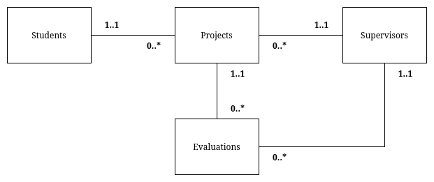
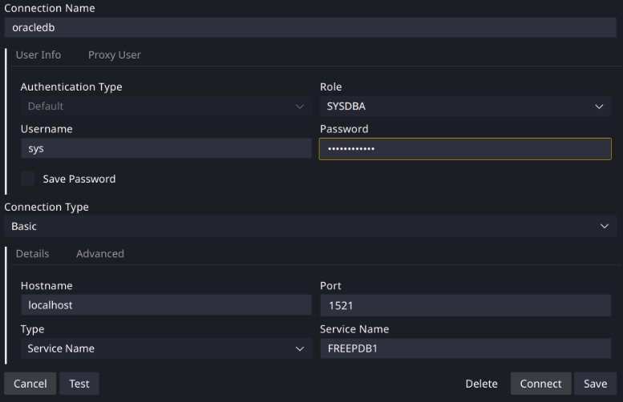

# IS3S662-oracle-coursework

Oracle PL/SQL coursework for Advanced Databases and Modelling (IS3S662) at the University of South Wales.

## Contents

- [IS3S662-oracle-coursework](#is3s662-oracle-coursework)
  - [Contents](#contents)
  - [Coursework Overview](#coursework-overview)
    - [Assessment Description](#assessment-description)
    - [Implementation Requirements](#implementation-requirements)
    - [Database Setup Scripts](#database-setup-scripts)
  - [Prerequisites](#prerequisites)
  - [Running the Oracle Database Container](#running-the-oracle-database-container)
  - [Connecting to the Database](#connecting-to-the-database)
  - [Setting Up the Database](#setting-up-the-database)
    - [Creating a Non-root User](#creating-a-non-root-user)
    - [Provisioning the Tables](#provisioning-the-tables)
    - [Inserting Sample Data](#inserting-sample-data)
    - [Queries and Packages](#queries-and-packages)
  - [Stopping, Restarting and Removing the Container](#stopping-restarting-and-removing-the-container)
  - [Linting and Formatting](#linting-and-formatting)
    - [SQLFluff](#sqlfluff)
      - [Permission Issues](#permission-issues)
    - [Markdownlint-cli](#markdownlint-cli)
    - [Aliasing](#aliasing)
    - [GitHub Actions](#github-actions)
  - [Credits, References and Acknowledgements](#credits-references-and-acknowledgements)

## Coursework Overview

### Assessment Description

You will take on the role of a database developer tasked with building and enhancing an Academic Project Management System using PL/SQL. This system is designed to support management of student projects, supervisor assignments, and project evaluations within a university setting.

You are provided with a database schema in the Appendix consisting of four interrelated tables: Students, Supervisors, Projects and Evaluations. Your goal is to implement and demonstrate meaningful PL/SQL logic that improves the functionality, integrity, and automation of this system.

Through this assignment, you will:

- Create and populate the database tables with realistic sample data.
- Identify three distinct operations that benefit from PL/SQL logic.
- Implement each operation using appropriate PL/SQL constructs (e.g. procedures, functions, triggers, etc.)
- Justify your design decisions and reflect on the development process in a structured report.

Once the schema is established, you must:

1. Identify three distinct operations or features that would benefit from PL/SQL logic (e.g. automated actions, validations, reuseable business logic).
2. Implement each operation using an appropriate PL/SQL construct such as:
   - Stored Procedure
   - Function
   - Trigger
   - Package

**Note:** You may use the same type of construct more than once, provided each addresses a distinct operation.

### Implementation Requirements

You are required to:

- Identify three distinct operational needs within the database system.
- For each, select a suitable construct and implement it.
- Ensure each construct is meaningful and enhances the system’s functionality, performance, or integrity

Examples of operations might include:

- Batch assign projects to students
- Automatically update project status
- Calculate the average grade for a project

### Database Setup Scripts

The given database schema is available in the `sql/tables` directory.

This will create 4 tables: Students, Supervisors, Projects, and Evaluations.



## Prerequisites

- Docker or Podman installed on your machine.
- If using Podman, ensure you have it alias docker or replace docker commands with podman.

## Running the Oracle Database Container

1. Pull the container image:

    ```bash
    docker pull docker.io/gvenzl/oracle-free:23.6-slim-faststart
    ```

2. Run the container:

    ```bash
    docker run --name oracledb -d -p 1521:1521 \
    -e ORACLE_PASSWORD=testpassword \
    docker.io/gvenzl/oracle-free:23.6-slim-faststart
    ```

## Connecting to the Database

To do this, I recommend using the SQL Developer VS Code extension.

[Install the SQL Developer extension](https://marketplace.visualstudio.com/items?itemName=Oracle.sql-developer) in VS Code.

Then, create a new connection with the following details:

```plaintext
Authentication Type: Default
Role: SYSDBA
Username: sys
Password: testpassword

Hostname: localhost
Port: 1521
Type: Service Name
Service Name: FREEPDB1
```

See the below screenshot for reference:



Once connected, you can run SQL and PL/SQL code against the Oracle database.

## Setting Up the Database

### Creating a Non-root User

After connecting to the database for the first time, you will need to create a new user/schema for the coursework.

This is because the default SYS user is a privileged administrative user and it is best practice to avoid using it for application development.
Additionally, there are lots of system tables which may clutter your view.

To create a new user, a SQL script is provided in [`sql/user-setup/user.sql`](./sql/user-setup/user.sql).

This will create a new user called `appuser` with password `password` and grant it administrative privileges.

This will allow you to do anything with the database, without needing to use the SYS user or see the system tables.

Once the user is created, disconnect from the SYS user and create a new connection in SQL Developer using the following details:

```plaintext
Authentication Type: Default
Role: Default
Username: appuser
Password: password

Hostname: localhost
Port: 1521
Type: Service Name
Service Name: FREEPDB1
```

This user should now be used for all further development work on the coursework.

### Provisioning the Tables

All table definitions are provided in the `sql/tables` directory.

Simply run each of the SQL scripts in that directory while connected as the `appuser` user to create the necessary tables for the coursework.

This should be done in the following order to satisfy foreign key constraints:

1. `students.sql`
2. `supervisors.sql`
3. `projects.sql`
4. `evaluations.sql`

### Inserting Sample Data

Sample data insertion scripts are provided in the `sql/sample-data` directory.

Run each of the SQL scripts in that directory while connected as the `appuser` user to populate the tables with sample data.

### Queries and Packages

The additional functionality the coursework requires can be implemented in the `sql/packages` directory.

Within the directory, you will find 3 separate subdirectories containing SQL scripts for each PL/SQL package, procedure, function or trigger that you need to implement, alongside a `README.md` file with information about the package.

[Explore the `sql/packages` directory for more details.](./sql/packages)

## Stopping, Restarting and Removing the Container

To stop the container, run:

```bash
docker stop oracledb
```

To restart the container, run:

```bash
docker restart oracledb
```

**Note:** Stopping the container will persist the database state, so your data will remain intact when you restart it.

Only removing the container will delete the database data.

To remove the container, run:

```bash
docker rm oracledb
```

## Linting and Formatting

### SQLFluff

This project uses [SQLFluff](https://www.sqlfluff.com/) for linting and formatting SQL code.

I recommend running SQLFLuff via Docker to avoid installation.

To lint the SQL files, run the following command in the project root directory:

```bash
docker run -it --rm -v $PWD:/sql ghcr.io/sqlfluff/sqlfluff:latest lint .
```

Or, to fix linting issues automatically, run:

```bash
docker run -it --rm -v $PWD:/sql ghcr.io/sqlfluff/sqlfluff:latest fix .
```

This makes use of the latest SQLFluff Docker image from GitHub Container Registry.

#### Permission Issues

If you encounter permission issues when running SQLFluff via Docker, you can adjust the permissions of the project files by running:

```bash
chmod -R a+rw .
```

### Markdownlint-cli

This project uses [markdownlint-cli](https://github.com/igorshubovych/markdownlint-cli) for linting Markdown files.

Again, I recommend running markdownlint-cli via Docker to avoid installation.

To lint the Markdown files, run the following command in the project root directory:

```bash
docker run -v $PWD:/workdir ghcr.io/igorshubovych/markdownlint-cli:latest "**/*.md"
```

Or, to fix linting issues automatically, run:

```bash
docker run -v $PWD:/workdir ghcr.io/igorshubovych/markdownlint-cli:latest "**/*.md" --fix
```

This makes use of the latest markdownlint-cli Docker image from GitHub Container Registry.

### Aliasing

I'd recommend adding aliases to your shell configuration file (e.g. `.bashrc` or `.zshrc`) for easier use of these commands.

```bash
# ~/.bashrc

# Markdownlint-cli
alias mdlint="docker run -v $PWD:/workdir ghcr.io/igorshubovych/markdownlint-cli:latest '**/*.md'"
alias mdfix="docker run -v $PWD:/workdir ghcr.io/igorshubovych/markdownlint-cli:latest '**/*.md' --fix"

# SQLFluff
alias sqllint="docker run -it --rm -v $PWD:/sql ghcr.io/sqlfluff/sqlfluff:latest lint ."
alias sqlfix="docker run -it --rm -v $PWD:/sql ghcr.io/sqlfluff/sqlfluff:latest fix ."
```

### GitHub Actions

All of the above linting and formatting checks are also run automatically via GitHub Actions on each push and pull request to the repository.

## Credits, References and Acknowledgements

- [Oracle Database Container Image by gvenzl](https://github.com/gvenzl/oci-oracle-free)
- [SQL Developer VS Code Extension](https://marketplace.visualstudio.com/items?itemName=Oracle.sql-developer)
- [Markdownlint-cli](https://github.com/igorshubovych/markdownlint-cli)
- [SQLFluff](https://github.com/sqlfluff/sqlfluff)
