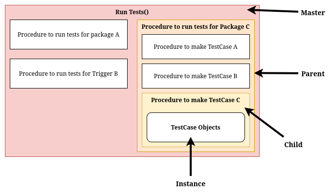

# Ideas for SQL Packages

This is a brainstorming document for ideas on SQL packages, triggers, views and indexes to create for the coursework.
Everything here is just ideas and suggestions. I may not implement all of these, and I may come up with new ideas as I go along.
The stuff here should be taken with a pinch of salt.

## Contents

- [Ideas for SQL Packages](#ideas-for-sql-packages)
  - [Contents](#contents)
  - [Structure](#structure)
  - [Package Ideas](#package-ideas)
    - [Core Items](#core-items)
      - [Package 1 - Supervisor Package](#package-1---supervisor-package)
      - [Package 2 - Student Package](#package-2---student-package)
      - [Trigger - Email Notification Trigger](#trigger---email-notification-trigger)
      - [Supervisor Testing Package](#supervisor-testing-package)
        - [Testing Facilities to Implement](#testing-facilities-to-implement)
        - [Tests to Implement](#tests-to-implement)
    - [Additional Items](#additional-items)
      - [View - Extended Project Information View](#view---extended-project-information-view)
      - [Indexes](#indexes)

## Structure

To get good marks, 2 packages and 1 trigger are needed.

Across the 3 items, the following Oracle features should be used:

*The following features are checked if I think they are included in the code.*

- [x] Variables
- [x] %Type
- [x] %RowType
- [x] Operators
- Conditional Statements
  - [x] IF..ELSE
  - [x] CASE
- Loops
  - [x] Basic LOOP
  - [x] FOR LOOP
  - [x] WHILE LOOP
  - [x] Nested Loops
- [x] String operations (maybe)
- [x] Arrays
- [x] Procedures
- [x] Functions
- Cursors
  - [x] Implicit Cursors
  - [x] Explicit Cursors
- Records
  - [x] Table Records
  - [x] Cursor Records
  - [x] User-Defined Records
- Exception Handling
  - [x] System-defined Exceptions
  - [x] User-defined Exceptions
- [x] Triggers
- [x] Packages
- Collections (maybe)
  - [x] Index-by Tables
  - [x] Nested Tables
  - [x] Varrays
- [x] Transactions
  - *Be good to demonstrate COMMIT, ROLLBACK, SAVEPOINT*
- [x] Printing output using DBMS_OUTPUT.PUT_LINE
- [x] Object oriented PL/SQL features
- [x] Dynamic SQL (if possible)

Additionally, I can create Views and Indexes as smaller separate components / items to show further understanding. For example:

- A view to extend project information with marking, student and supervisor details.
- An index on the project table to speed up lookups by student (This index here should depend on whatever functionality I implement in the packages / trigger).

## Package Ideas

### Core Items

#### Package 1 - Supervisor Package

- Procedure to mark projects (Using Parameters, Transactions)
- Function to get grade based on passed mark (CASE)
- Function to calculate pass/fail (IF..ELSE)
- Procedure to get student's average mark across all projects (Implicit Cursor, LOOP)
  - This will be replaced by a produce student report procedure.
  - This will make use of dynamic SQL to build a table name based on student ID.
  - It will output the average mark.
  - It will also include a summary of the student's performance (e.g. number of projects passed/failed).
- Get list of projects supervised by a supervisor for a status (Explicit Cursor, Cursor Records, FOR LOOP)
- Exception handling for invalid project IDs, invalid marks, etc.
- Procedure to remark a project (Using Parameters, Explicit Cursor)
- Procedure to view projects ready for marking
- Procedure to get notifications for a supervisor
  - Procedure to acknowledge receipt of evaluation requests (Set that notification as read)
  - This could use OOP here to make a notification object with methods to mark as read, get details, etc.

#### Package 2 - Student Package

*This never got implemented since it duplicates a lot of functionality from the Supervisor Package.*
*It's annoying since I haven't shown all of the notification logic for students which I laid foundations for in the trigger idea below.*
*But I really don't want to duplicate code just for the sake of it.*

**This functionality has been replace by the testing suite for the Supervisor Package.**

- Procedure to get projects by status for a student
- Procedure to get project and performance summary (i.e. Average mark, grade, number of projects passed/failed, number of projects pending)
- Function to calculate overall grade across all projects (Implicit Cursor, LOOP)
- Procedure to submit a project (Using Parameters, Transactions)
- Procedure to view feedback for a project
- Exception handling for invalid project IDs, unauthorized access, etc.
- Procedure to get current notifications for a student
  - Procedure to acknowledge receipt of feedback (Set that notification as read)
  - This could use OOP here to make a notification object with methods to mark as read, get details, etc.

#### Trigger - Email Notification Trigger

When an evaluation record is inserted or updated, append a notification message to a log table indicating that an email would be sent to the student.

This should include what grade they got and any comments from the supervisor.

Additionally, I could think about having different types of notifications. For example, student and staff notifications.

- For student notifications, it could have a pass email, fail email.
- Maybe a separate trigger for if a project is remarked? (<-- This can be done in a single trigger with conditional logic to figure out which type of operation is performed).
- For staff notifications, it could be a proof of evaluation/receipt email.

^ I can embed some string logic here too.

For example, I could embed the type of evaluation into its ID.

ps001 = Passed
fs001 = Failed
rs001 = Remarked
rc001 = Receipt for staff

I could also have a type column in this table to show if an email is for staff or student.

I could use a collection here to define different email templates for each type of notification.

For example

| Type | Subject            | Body                                   | Audience |
|------|--------------------|----------------------------------------|----------|
| ps   | Project Passed     | Congratulations, you have passed...    | Student  |
| fs   | Project Failed     | Unfortunately, you have not passed...  | Student  |
| rs   | Project Remarked   | Your project has been remarked...      | Student  |
| rc   | Evaluation Receipt | An evaluation has been recorded...     | Staff    |

#### Supervisor Testing Package

This package will contain procedures and functions to test the functionality of the Supervisor Package.
This will include test cases for the various procedures and functions in the Supervisor Package to ensure they work as expected (unit tests).

On GitHub, I managed to find a similar project that implements a testing framework for PL/SQL called [utPLSQL](https://github.com/utPLSQL/utPLSQL). With my testing package, I will look to implement similar functionality but on a smaller scale and specifically tailored to my needs.

To ensure that I can unit test my existing code (without refactoring), I did a quick PoC (`./sql/misc/proof-of-concept-testing.sql`). This shows that I can collect outputs from my procedures/functions (i.e. DBMS_OUTPUT and Error Raises) and capture them in my testing package to verify against expected outputs.

##### Testing Facilities to Implement

- Function to assert a certain error is raised when expected.
  - This should collect the raised error and use `ERRMSG` to verify against expected error message.
- Function to assert expected output from DBMS_OUTPUT.
  - This should capture DBMS_OUTPUT and verify against expected output.
- Function to assert 2 values are equal.
  - This will be useful when checking return values from functions, and verifying that records are inserted correctly (i.e. assert that the number of records in a table matches the expected count).

##### Tests to Implement

The tests in `./sql/tests/test-supervisor.sql` will make use of the above testing facilities to implement unit tests for the Supervisor Package.

Each test case should be its own procedure, and should cover a specific functionality of the Supervisor Package.

A parent procedure will then be needed to call each test case in turn for a specific component in the package.

Additionally, a master procedure will be needed to call all the parent procedures for each component in the package to run all tests in one go.

I will need to think about how to consistently structure the tests so their reporting is clear and easy to understand. Could I use OOP for this?

For example, I could create a TestCase object with properties like name, description, expected output, actual output, status (pass/fail), etc.

Then give it methods to compare expected and actual outputs, and to print a summary of the test case.

```json
TestCase {
  name: "Test Mark Project with Valid Data",
  description: "Tests marking a project with valid data",
  expectedOutput: "Project marked successfully",
  actualOutput: "",
  status: "Not Run",
  
  methods: {
    runTest(), // Runs the test case (compares expected and actual outputs)
    printSummary()
  }
}
```

This TestCase object would be populated with data for each test case, and then the runTest method would be called to execute the test and compare outputs.

This could replace the parent, master procedure structure mentioned earlier, making the testing framework more modular and easier to extend in the future.

Have a master to run all tests. Have child procedures to define the test cases and run them.



### Additional Items

#### View - Extended Project Information View

Create a view to extend project information with marking, student and supervisor details.

#### Indexes

- Index on project table to speed up lookups by student ID and status.
- Index on project table to speed up lookups by supervisor ID and status.
- Index on notification table to speed up lookups by person ID (StudentID if student, SupervisorID if supervisor) and notification status (read/unread).
